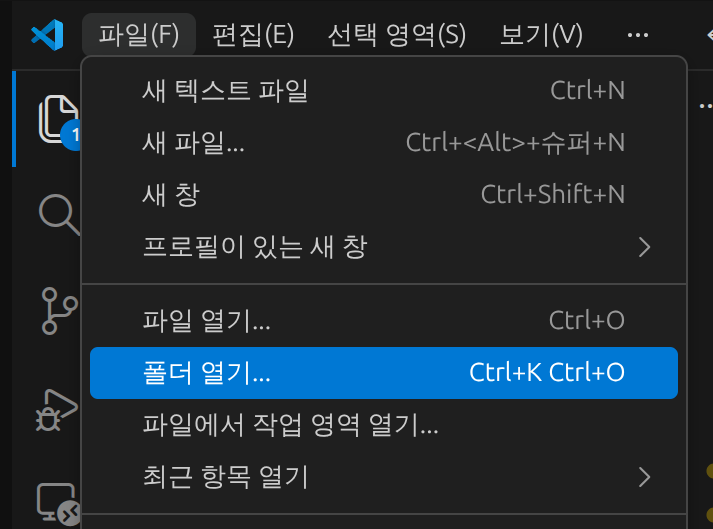
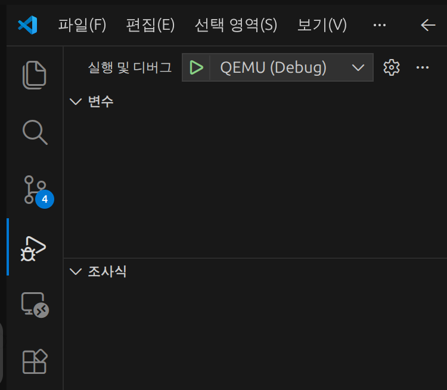
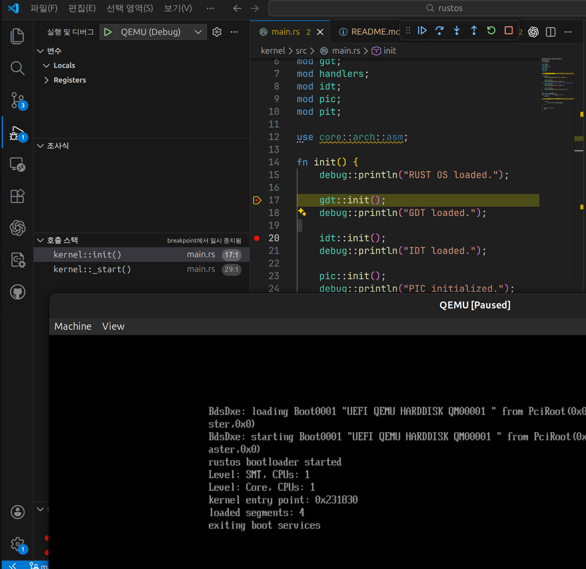

# 개요

Rust 를 활용한 생산적이고 효율적인 OS 개발 프로젝트입니다.

## 패키지 설치

```bash
sudo apt update

sudo apt install -y rustup

rustup default nightly
rustup component add rust-src llvm-tools-preview
rustup target add x86_64-unknown-uefi

sudo apt install -y make qemu-system-x86 ovmf
```

# Visual Studio code

## 빌드 및 실행



여기에서 프로젝트 폴더를 열어주세요.



버튼을 눌러 실행하시면 자동으로 빌드 및 실행이 이루어집니다.

## 디버그

반드시 실행 시 ```QEMU (Debug)``` 로 하셔야 합니다.

디버그 방법은 기본적으로 응용프로그램과 동일하며, 소스코드 좌측의 중단점을 기반으로 작동합니다.



<br>

# 터미널

터미널에서 개발하는 것은 가급적 권장하지 않습니다.

그래도 필요하다면 아래의 절차를 밟아주세요.

## 빌드 및 실행

프로젝트 루트에서 아래 명령을 실행하세요.

```bash
make build
./run.sh
```

run.sh 는 기본적으로 빌드를 포함하고 있지 않습니다.
make build 를 반드시 함께 실행하세요.

## 빌드 삭제

빌드의 산물을 삭제하려면 아래 명령을 실행하세요.

```bash
make clean
```