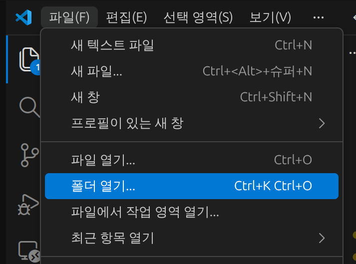

# 📖 개요

- [📖 개요](#-개요)
- [🗂 소스 구조](#-소스-구조)
- [📦 패키지 설치](#-패키지-설치)
- [🛠 Visual Studio code](#-visual-studio-code)
  - [빌드 및 실행](#빌드-및-실행)
  - [디버그](#디버그)
- [🖥 터미널](#-터미널)
  - [빌드 및 실행](#빌드-및-실행-1)
  - [빌드 삭제](#빌드-삭제)

</details>

<br>

# 🗂 소스 구조

- `bootloader/src/boot/`: UEFI 부트 체인, ELF 적재, 부트 정보, 오류 처리
- `bootloader/src/platform/`: UEFI 디버그 출력, GOP 초기화, RNG 시드
- `bootloader/src/runtime/`: panic/alloc 같은 런타임 핸들러
- `prekernel/src/load/`: `kernel.elf` 적재
- `prekernel/src/runtime/`: prekernel 디버그/힙 초기화
- `kernel/src/arch/`: GDT, IDT, PIC/PIT/RTC, 저수준 asm 진입점
- `kernel/src/input/`: 키보드 드라이버
- `kernel/src/io/`: GUI 콘솔, TTY, 콘솔 출력 계층
- `kernel/src/memory/`: 힙과 가상 메모리
- `kernel/src/storage/`: FAT 부트 볼륨 접근
- `kernel/src/user/`: 데모 실행, ELF/PE 프로세스 로드, syscall/Win32 shim
- `kernel/src/util/`: 랜덤, 링 버퍼 같은 범용 유틸리티
- `kernel/src/debug/`, `kernel/src/multitask/`: 디버그 및 스케줄러는 별도 디렉터리 유지

# 📦 패키지 설치

```bash
sudo apt update

sudo apt install -y rustup

rustup default nightly
rustup component add rust-src llvm-tools-preview
rustup target add x86_64-unknown-uefi

sudo apt install -y make qemu-system-x86 ovmf
```

# 🛠 Visual Studio code

## 빌드 및 실행



여기에서 프로젝트 폴더를 열어주세요.


버튼을 눌러 실행하시면 자동으로 빌드 및 실행이 이루어집니다.

## 디버그

반드시 실행 시 ```QEMU (Debug)``` 로 하셔야 합니다.

디버그 방법은 기본적으로 응용프로그램과 동일하며, 소스코드 좌측의 중단점을 기반으로 작동합니다.


<br>

# 🖥 터미널

터미널에서 개발하는 것은 가급적 권장하지 않습니다.

그래도 필요하다면 아래의 절차를 밟아주세요.

## 빌드 및 실행

프로젝트 루트에서 아래 명령을 실행하세요.

```bash
make build
./run.sh
```

run.sh 는 기본적으로 빌드를 포함하고 있지 않습니다.
make build 를 반드시 함께 실행하세요.
실행 시에는 `build/` 를 `/tmp` 임시 디렉터리로 복제한 뒤 그 복제본을 vvfat 디스크로 사용합니다.
QEMU/UEFI, 특히 KVM 경로에서 `build/` 를 vvfat 로 직접 물리면 호스트의 `kernel.elf`,
`BOOTX64.EFI`, `startup.nsh`, `NvVars` 같은 빌드 산물의 timestamp/metadata 가 오염됩니다.
임시 복제본을 쓰는 이유는 호스트 `build/` 를 그대로 보존하기 위해서입니다.

## 빌드 삭제

빌드의 산물을 삭제하려면 아래 명령을 실행하세요.

```bash
make clean
```
