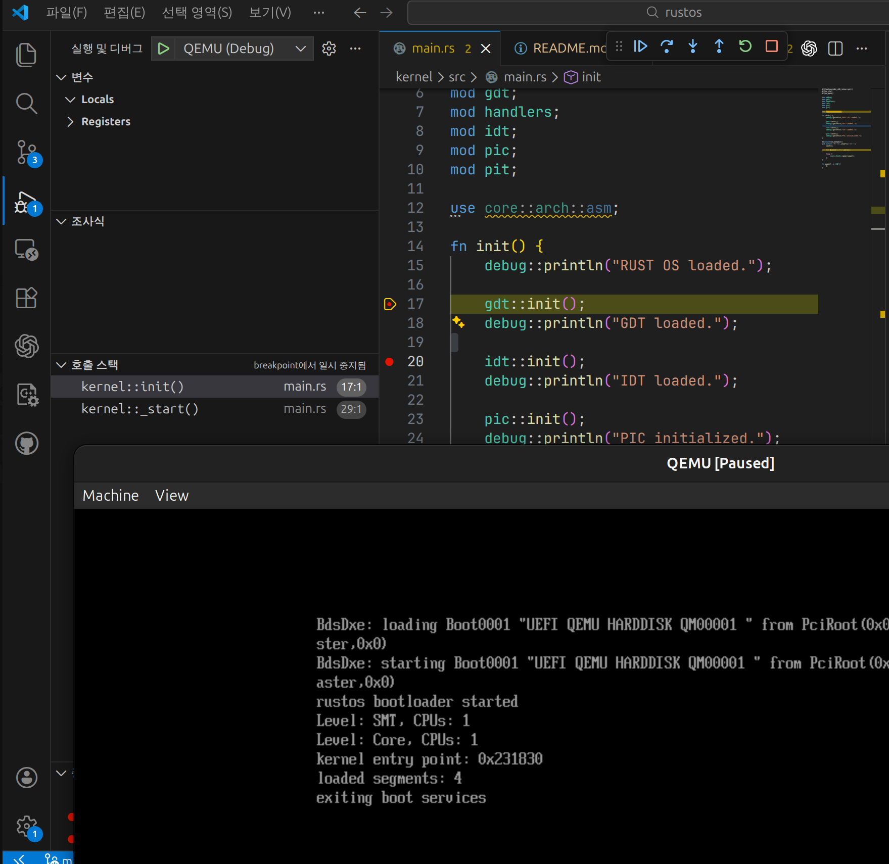

# RustOS

[](https://github.com/ierwarf/rustos/actions/workflows/rust.yml)
[](https://ierwarf.github.io/rustos/)
[](LICENSE)

RustOS is an experimental Rust-first operating system workspace with a GRUB EFI
boot manager path, layered kernel crates, userspace services, a framebuffer
desktop UI, compatibility work, and manifest-driven image staging.



[English](#english) | [한국어](#korean)

<a id="english"></a>

## English

RustOS is organized as an OS development platform rather than a single kernel
crate. The main flow is:

```text
cargo xtask build -> build/image -> cargo xtask run -> QEMU boot
```

Start here:

- [Documentation Home](docs/index.md)
- [Getting Started](docs/getting-started.md)
- [Execution Flow](docs/execution-flow.md)
- [Structure Guide](docs/structure.md)
- [Logging Guide](docs/logging.md)
- [Kernel API](docs/api/kernel.md)
- [OS Developer APIs](docs/api/xtask.md)
- [AI Agent Reference](docs/ai/README.md)

Current status:

| Area | Status |
| --- | --- |
| GRUB EFI boot manager | Present |
| Layered kernel crates | Present |
| Manifest-driven image staging | Present |
| Userspace services | Present |
| Framebuffer desktop UI | Present |
| Compatibility layer work | In progress |
| Public release artifacts | Planned |

Quick commands:

```bash
cargo xtask check
cargo xtask build
cargo xtask run
```

The staged boot volume is `build/image`, and the default UEFI entry is the
GRUB-generated `build/image/EFI/BOOT/BOOTX64.EFI`.

<a id="korean"></a>

## 한국어

RustOS는 단일 kernel crate가 아니라 OS 개발 플랫폼 형태로 구성된 실험적
Rust-first 운영체제 workspace입니다. 기본 흐름은 다음과 같습니다.

```text
cargo xtask build -> build/image -> cargo xtask run -> QEMU boot
```

먼저 볼 문서:

- [문서 홈](docs/index.md)
- [시작하기](docs/getting-started.md)
- [실행 흐름](docs/execution-flow.md)
- [구조 가이드](docs/structure.md)
- [로깅 가이드](docs/logging.md)
- [Kernel API](docs/api/kernel.md)
- [OS 개발 API](docs/api/xtask.md)
- [AI Agent Reference](docs/ai/README.md)

현재 상태:

| 영역 | 상태 |
| --- | --- |
| GRUB EFI boot manager | 구현됨 |
| layered kernel crates | 구현됨 |
| manifest 기반 image staging | 구현됨 |
| userspace services | 구현됨 |
| framebuffer desktop UI | 구현됨 |
| compatibility layer | 진행 중 |
| public release artifacts | 예정 |

빠른 실행 명령:

```bash
cargo xtask check
cargo xtask build
cargo xtask run
```

staged boot volume은 `build/image`이며, 기본 UEFI entry는 GRUB이 생성한
`build/image/EFI/BOOT/BOOTX64.EFI`입니다.
