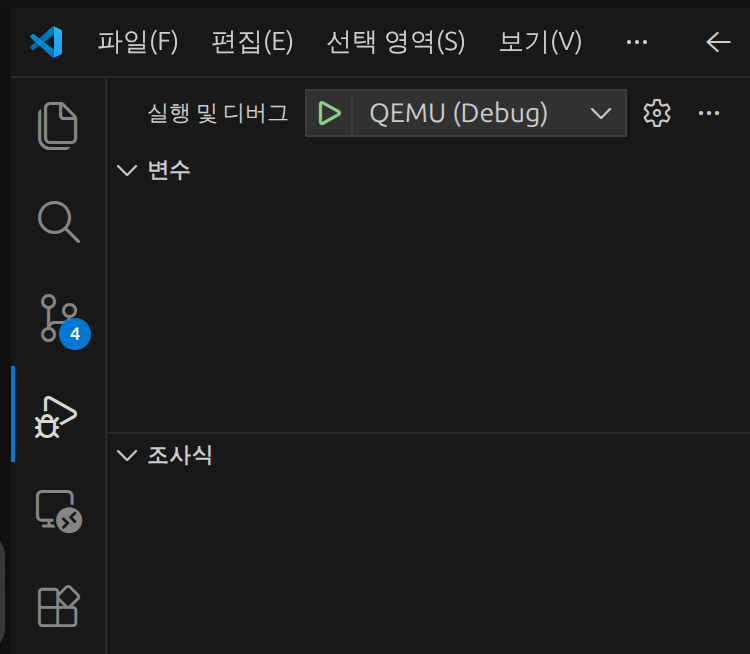

# RustOS

RustOS is an experimental Rust-first OS workspace with a UEFI boot chain, a
layered kernel, userspace services, a small desktop UI, Linux/Windows
compatibility work, and manifest-driven image staging.

## 한국어

### 개요

기본 개발 흐름은 `cargo xtask build`로 부팅 이미지를 만들고
`cargo xtask run`으로 QEMU에서 실행하는 방식입니다. staged 부팅 볼륨은
`build/image`에 생성되며, UEFI 기본 엔트리는
`build/image/EFI/BOOT/BOOTX64.EFI`입니다.

최근 구조는 `RUSTOS.package.toml` 기반 패키지 manifest, runtime registry,
Wayland 기반 UI server, observability/logging 설정을 중심으로 정리되어
있습니다. 자세한 계층 규칙은 [docs/structure.md](docs/structure.md)를
참고하세요.

### 디렉터리

- `boot/`: UEFI bootloader, prekernel, boot protocol
- `kernel/`: nucleus와 HAL, MM, object, IPC, process, IO, compat, executive 계층
- `services/`: `initd`, `runtimed`, `sessiond`, `uiserver` 같은 user service
- `apps/`: shell, smoke app, Wayland demo, Windows user demo
- `drivers/`: bridge driver, driver ABI/runtime/helper crate
- `compat/`: Windows/Linux 호환 계층과 winsys DLL bundle
- `libs/`: 여러 계층에서 공유하는 일반 crate
- `config/`: runtime logging 같은 host/build time 설정
- `assets/image/`: staged image에 그대로 들어가는 정적 overlay
- `assets/ui/`: UI font assets
- `vendor/`: OVMF, firmware, prebuilt module 같은 외부 바이너리 자산
- `build/artifacts/`: 빌드 산출물
- `build/image/`: 실제 QEMU 부팅 볼륨
- `logs/`: `debugcon.log`, `qemu_interrupt.log`, GDB helper 등 실행 로그
- `tools/xtask/`: build, stage, QEMU 실행, 계층 검사 도구

### 준비

Ubuntu/Debian 기준:

```bash
sudo apt update
sudo apt install -y rustup gcc nasm qemu-system-x86 ovmf mingw-w64

rustup default nightly
rustup component add rust-src llvm-tools-preview
rustup target add x86_64-unknown-uefi
rustup target add x86_64-unknown-linux-gnu
```

기본 OVMF 경로는 `vendor/firmware/ovmf/OVMF.fd`입니다. 다른 firmware를
쓰려면 `OVMF_PATH=/path/to/OVMF.fd`를 지정하세요.

### 빌드와 실행

```bash
cargo xtask check
cargo xtask build
cargo xtask run
```

`cargo xtask build`는 계층 검사, bootloader/prekernel/kernel/userspace,
driver module, Windows DLL bundle, staged image 생성을 한 번에 수행합니다.
`cargo xtask run`은 기존 `build/image`를 실행하므로, 이미지 내용이 바뀌면
먼저 `cargo xtask build` 또는 `cargo xtask stage`를 실행하세요.

자주 쓰는 명령:

- `cargo xtask stage`: 빌드 산출물과 overlay를 `build/image`에 배치
- `cargo xtask debug`: QEMU를 `-s -S`로 띄우고 `logs/rustos-debug.gdb` 생성
- `cargo xtask probe-display`: headless display smoke/probe 실행
- `cargo xtask build-user`: userspace service/app 빌드
- `cargo xtask build-driver-modules`: bridge driver module 빌드
- `cargo xtask clean`: cargo/build 산출물 정리
- `cargo test -p module-tests`: module-level 테스트

QEMU 옵션 예:

```bash
cargo xtask run -- --no-reboot
cargo xtask run --profile nvme
cargo xtask run --accel-profile kvm
cargo xtask run --usb-input
cargo xtask run --qemu-log int
cargo xtask run --debugcon stdio
```

기본 QEMU 장치는 `virtio-vga`와 usernet `virtio-net-pci`를 붙입니다. 네트워크를
끄려면 `--no-network`를 사용하세요.

### VS Code

공용 launch 구성은 `QEMU`, `KVM`, `G14` 흐름을 기준으로 사용합니다.

- `QEMU`: build task를 실행한 뒤 기본 QEMU profile로 부팅
- `KVM`: KVM acceleration과 host CPU profile 사용
- `G14`: `g14` profile과 더 큰 메모리/CPU 설정 사용




### 패키지와 stage 규칙

배포 단위의 source of truth는 각 패키지 루트의
`RUSTOS.package.toml`입니다. `kind`, `execution_domain`, `startup`,
`install.path`, `desktop.entries`, `runtime_deps`, `autoload`가 stage와
runtime registry를 결정합니다.

- `services/uiserver/RUSTOS.package.toml` -> `services/uiserver/uiserver.elf`
- `apps/wayclick/RUSTOS.package.toml` -> `apps/wayclick/wayclick.elf`
- `drivers/bridges/display/amdgpu/RUSTOS.package.toml` -> `system/drivers/display/amdgpu.ko`
- `vendor/firmware/ovmf/OVMF.fd` -> QEMU firmware
- `assets/image/etc/ld.so.conf` -> `build/image/etc/ld.so.conf`

stage 단계는 다음 registry를 생성합니다.

- `system/registry/kernel/loadable-drivers.tsv`
- `system/registry/system/desktop-programs.tsv`
- `system/registry/system/runtime-launch-programs.tsv`
- `system/registry/system/startup-programs.tsv`
- `system/registry/compat/windows-system-dlls.txt`

### Logging

기본 logging 설정은 [config/logging.toml](config/logging.toml)에 있습니다.
`enabled`, `boot_trace_enabled`, `serial_mirror`, `ring_buffer_bytes`,
`min_level`, category별 level을 여기서 조정합니다.

실행 로그는 repo root의 `logs/` 아래에 남깁니다.

- `logs/debugcon.log`: 기본 debugcon 출력
- `logs/qemu_interrupt.log`: `--qemu-log int`를 켰을 때 QEMU interrupt trace
- `logs/rustos-debug.gdb`: `cargo xtask debug`가 생성하는 GDB helper

### UI

`services/uiserver`는 framebuffer에 직접 그리는 desktop UI입니다. 현재 UI는
Wayland window snapshot, console window, launcher, taskbar, dirty-rect
partial redraw를 처리합니다. 최근 업데이트에서는 상단 RustOS brand 영역,
더 선명한 launcher button, 상태 영역, focused task indicator, 개선된 window
chrome 색상과 대비가 반영되어 있습니다.

## English

### Overview

The normal development flow is `cargo xtask build` followed by
`cargo xtask run`. The staged boot volume is generated under `build/image`,
and the default UEFI entry is `build/image/EFI/BOOT/BOOTX64.EFI`.

The current workspace is organized around `RUSTOS.package.toml` package
manifests, generated runtime registries, a Wayland-aware UI server, and
centralized observability/logging configuration. See
[docs/structure.md](docs/structure.md) for the enforced layering rules.

### Directories

- `boot/`: UEFI bootloader, prekernel, boot protocol
- `kernel/`: nucleus plus HAL, MM, object, IPC, process, IO, compat, executive layers
- `services/`: user services such as `initd`, `runtimed`, `sessiond`, `uiserver`
- `apps/`: shell, smoke apps, Wayland demo, Windows user demo
- `drivers/`: bridge drivers and driver ABI/runtime/helper crates
- `compat/`: Windows/Linux compatibility code and winsys DLL bundle
- `libs/`: shared general-purpose crates
- `config/`: host/build-time configuration such as runtime logging
- `assets/image/`: static overlay copied into the staged image
- `assets/ui/`: UI font assets
- `vendor/`: external binaries such as OVMF, firmware, and prebuilt modules
- `build/artifacts/`: build artifacts
- `build/image/`: QEMU boot volume
- `logs/`: `debugcon.log`, `qemu_interrupt.log`, GDB helper, and run logs
- `tools/xtask/`: build, stage, QEMU run, and layering tools

### Prerequisites

For Ubuntu/Debian:

```bash
sudo apt update
sudo apt install -y rustup gcc nasm qemu-system-x86 ovmf mingw-w64

rustup default nightly
rustup component add rust-src llvm-tools-preview
rustup target add x86_64-unknown-uefi
rustup target add x86_64-unknown-linux-gnu
```

The default OVMF image is `vendor/firmware/ovmf/OVMF.fd`. Set
`OVMF_PATH=/path/to/OVMF.fd` to use a different firmware image.

### Build And Run

```bash
cargo xtask check
cargo xtask build
cargo xtask run
```

`cargo xtask build` runs layering checks, builds the bootloader, prekernel,
kernel, userspace, driver modules, Windows DLL bundle, and then stages the
boot image. `cargo xtask run` runs the existing `build/image`, so rebuild or
restage first after changing image contents.

Useful commands:

- `cargo xtask stage`: copy artifacts and overlays into `build/image`
- `cargo xtask debug`: start QEMU with `-s -S` and write `logs/rustos-debug.gdb`
- `cargo xtask probe-display`: run the headless display smoke/probe path
- `cargo xtask build-user`: build userspace services/apps
- `cargo xtask build-driver-modules`: build bridge driver modules
- `cargo xtask clean`: remove cargo/build outputs
- `cargo test -p module-tests`: run module-level tests

QEMU examples:

```bash
cargo xtask run -- --no-reboot
cargo xtask run --profile nvme
cargo xtask run --accel-profile kvm
cargo xtask run --usb-input
cargo xtask run --qemu-log int
cargo xtask run --debugcon stdio
```

The default QEMU setup attaches `virtio-vga` and usernet `virtio-net-pci`.
Use `--no-network` to disable the default network device.

### VS Code

The shared launch flows are `QEMU`, `KVM`, and `G14`.

- `QEMU`: run the build task and boot with the default QEMU profile
- `KVM`: use KVM acceleration and the host CPU profile
- `G14`: use the `g14` profile with larger memory/CPU settings

### Package And Stage Rules

The deployment source of truth is each package root's `RUSTOS.package.toml`.
Fields such as `kind`, `execution_domain`, `startup`, `install.path`,
`desktop.entries`, `runtime_deps`, and `autoload` drive staging and runtime
registry generation.

- `services/uiserver/RUSTOS.package.toml` -> `services/uiserver/uiserver.elf`
- `apps/wayclick/RUSTOS.package.toml` -> `apps/wayclick/wayclick.elf`
- `drivers/bridges/display/amdgpu/RUSTOS.package.toml` -> `system/drivers/display/amdgpu.ko`
- `vendor/firmware/ovmf/OVMF.fd` -> QEMU firmware
- `assets/image/etc/ld.so.conf` -> `build/image/etc/ld.so.conf`

Staging generates:

- `system/registry/kernel/loadable-drivers.tsv`
- `system/registry/system/desktop-programs.tsv`
- `system/registry/system/runtime-launch-programs.tsv`
- `system/registry/system/startup-programs.tsv`
- `system/registry/compat/windows-system-dlls.txt`

### Logging

The default logging policy is in [config/logging.toml](config/logging.toml).
It controls `enabled`, `boot_trace_enabled`, `serial_mirror`,
`ring_buffer_bytes`, `min_level`, and per-category levels.

Run logs are written under `logs/`.

- `logs/debugcon.log`: default debugcon output
- `logs/qemu_interrupt.log`: QEMU interrupt trace when `--qemu-log int` is enabled
- `logs/rustos-debug.gdb`: GDB helper generated by `cargo xtask debug`

### UI

`services/uiserver` renders the desktop directly into the framebuffer. It
handles Wayland window snapshots, console windows, the launcher, the taskbar,
and dirty-rect partial redraw. The latest UI refresh adds a RustOS brand area,
clearer launcher buttons, a compact status area, focused task indicators, and
improved window chrome colors/contrast.
